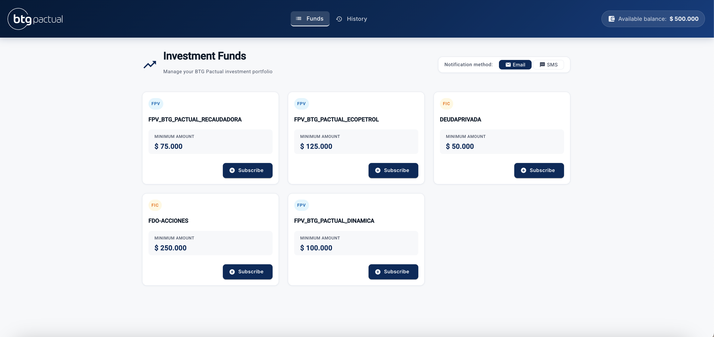
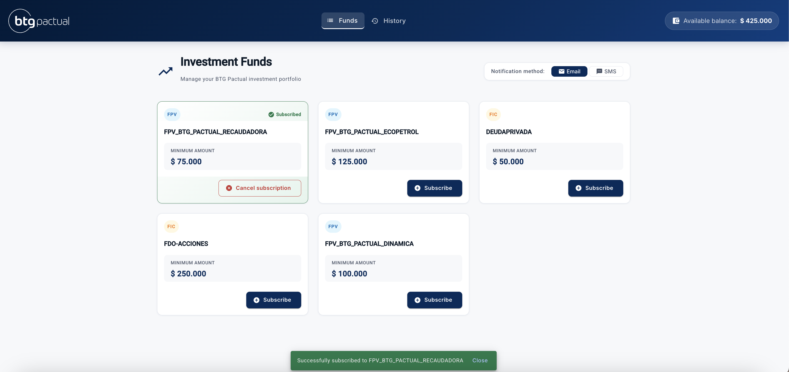
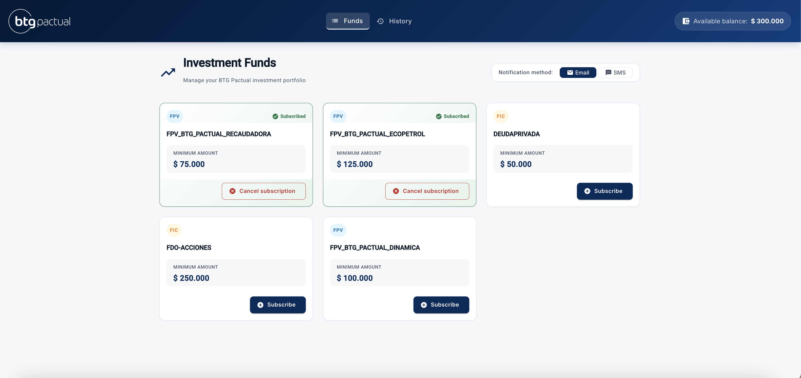
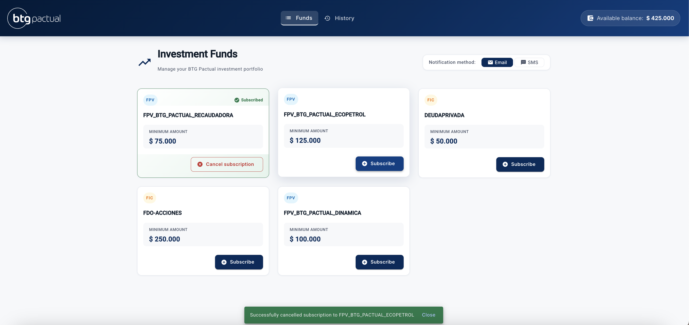
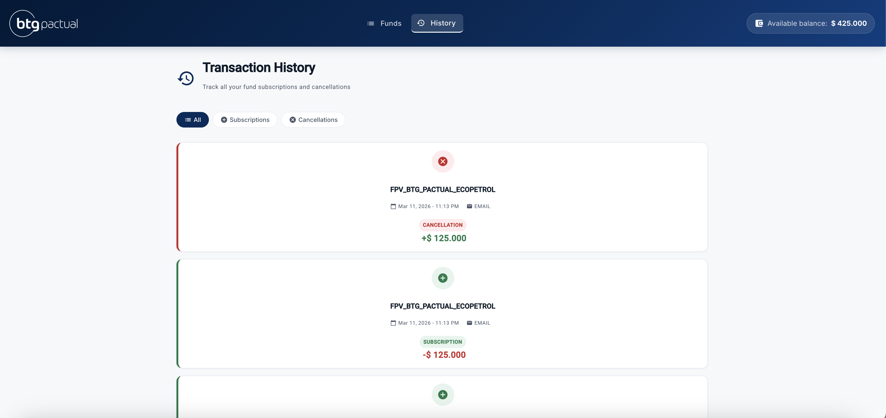
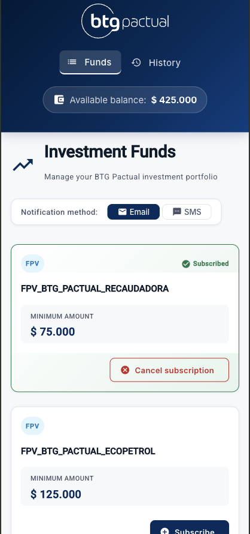
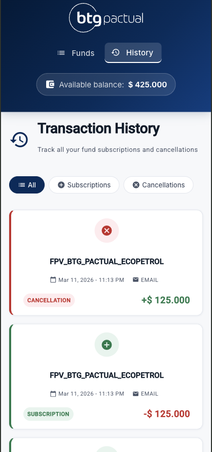
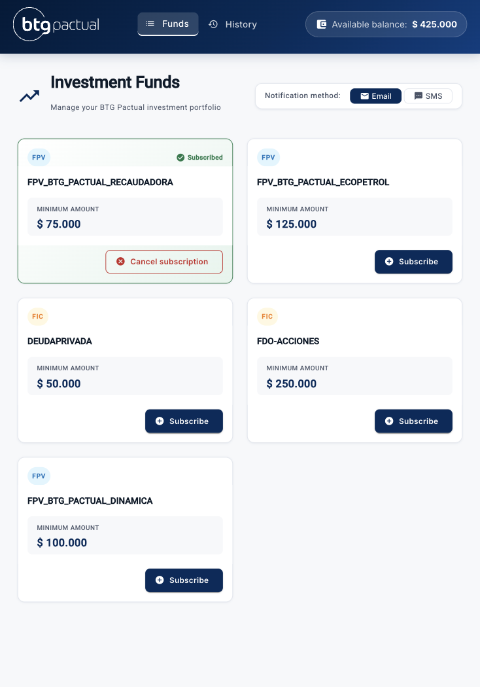
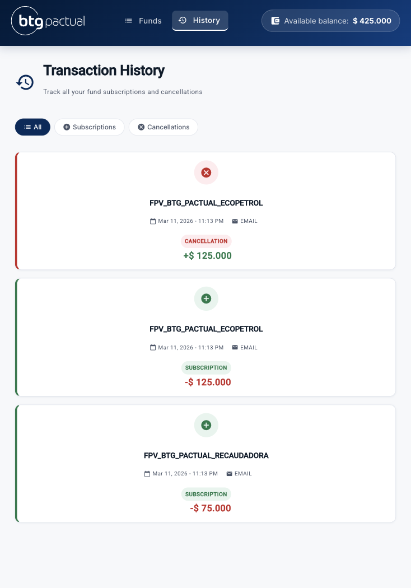

# BTG Pactual - Investment Funds Manager

A web application for managing BTG Pactual investment funds (FPV/FIC), built with Angular 18 and NgRx.


---

## Features

- View all available investment funds
- Subscribe to a fund (with minimum balance validation)
- Cancel fund subscription (balance is returned)
- Transaction history with filters (All / Subscriptions / Cancellations)
- Notification method selector (Email or SMS)
- Error messages when balance is insufficient
- Responsive design for mobile and desktop

---

## Screenshots

### Investment Funds



### Subscribed Funds




### Unsubscribed Funds



### Transaction History



### Mobile Responsive (Funds)



### Mobile Responsive (History)



### Tablet Responsive (Funds)



### Tablet Responsive (History)



## Tech Stack

| Technology       | Version | Purpose              |
| ---------------- | ------- | -------------------- |
| Angular          | 18      | Frontend framework   |
| NgRx             | 18      | State management     |
| Angular Material | 18      | UI components        |
| TypeScript       | 5.5     | Language             |
| SCSS             | -       | Styles               |
| RxJS             | 7.8     | Reactive programming |

---

## Architecture

The project follows the **Core / Shared / Feature** architecture pattern recommended for enterprise Angular applications.

```
src/app/
├── core/                         # Singleton services, models, store
│   ├── models/                   # TypeScript interfaces
│   │   ├── fund.model.ts
│   │   ├── transaction.model.ts
│   │   └── user.model.ts
│   ├── services/                 # API services (mock)
│   │   ├── funds.service.ts
│   │   └── mock-data.ts
│   └── store/                    # NgRx store
│       ├── funds/                # Actions, reducer, selectors, effects
│       ├── user/                 # Actions, reducer, selectors, effects
│       └── transactions/         # Actions, reducer, selectors
├── shared/                       # Reusable components and pipes
│   └── pipes/
│       └── cop-currency.pipe.ts  # COP currency formatter
└── features/                     # Feature modules (lazy loaded)
    ├── funds/                    # Funds page
    └── history/                  # Transaction history page
```

### State Management (NgRx)

```
User Action → Dispatch Action → Effect (async) → Reducer → New State → Selector → Component
```

Three feature stores:

- **user** → current balance
- **funds** → list of funds and subscription status
- **transactions** → transaction history

---

## Prerequisites

- Node.js >= 18
- npm >= 9
- Angular CLI >= 18

```bash
npm install -g @angular/cli@18
```

---

## Installation

```bash
# Clone the repository
git clone https://github.com/lauracamacholeon/btg-founds.git

# Navigate to the project
cd btg-founds

# Install dependencies
npm install
```

---

## Running the app

```bash
# Development server
ng serve

# Open in browser
http://localhost:4200
```

---

## Running tests

```bash
# Run all unit tests
ng test

```

---

## Code Quality

This project uses ESLint with Angular-specific rules for static code analysis.

```bash
# Run lint
ng lint

```

### Lint rules enforced

- `@angular-eslint/prefer-inject` → use `inject()` function over constructor injection
- `@angular-eslint/template/prefer-control-flow` → use `@if`, `@for` instead of `*ngIf`, `*ngFor`
- `@typescript-eslint/no-explicit-any` → avoid using `any` type
- `@typescript-eslint/no-unused-vars` → no unused variables
- `@angular-eslint/no-empty-lifecycle-method` → no empty lifecycle hooks

## Business Rules

- Initial user balance: **COP $500.000**
- A user can only subscribe to a fund if their balance is >= the fund's minimum amount
- When subscribing, the minimum amount is deducted from the balance
- When cancelling, the minimum amount is returned to the balance
- Each transaction records the notification method selected (Email or SMS)

---

## Available Funds

| ID  | Name                        | Minimum Amount | Category |
| --- | --------------------------- | -------------- | -------- |
| 1   | FPV_BTG_PACTUAL_RECAUDADORA | COP $75.000    | FPV      |
| 2   | FPV_BTG_PACTUAL_ECOPETROL   | COP $125.000   | FPV      |
| 3   | DEUDAPRIVADA                | COP $50.000    | FIC      |
| 4   | FDO-ACCIONES                | COP $250.000   | FIC      |
| 5   | FPV_BTG_PACTUAL_DINAMICA    | COP $100.000   | FPV      |

---

## Author

Laura Camacho León  
Frontend Developer  
[GitHub](https://github.com/lauracamacholeon)
